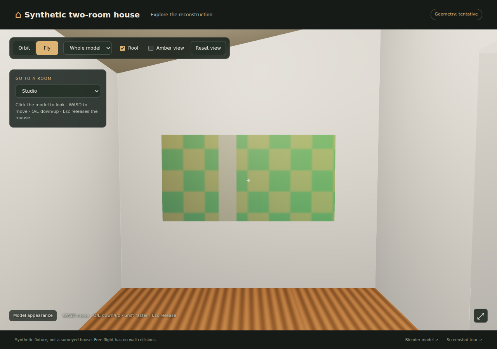
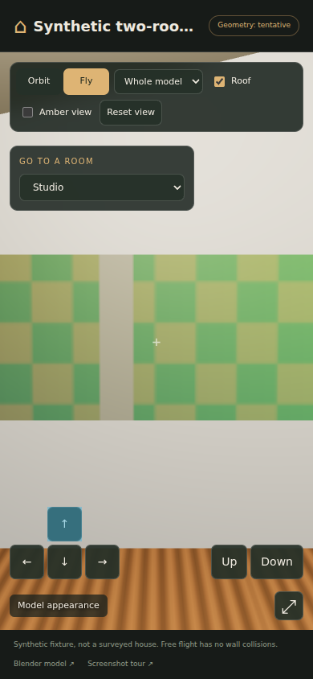
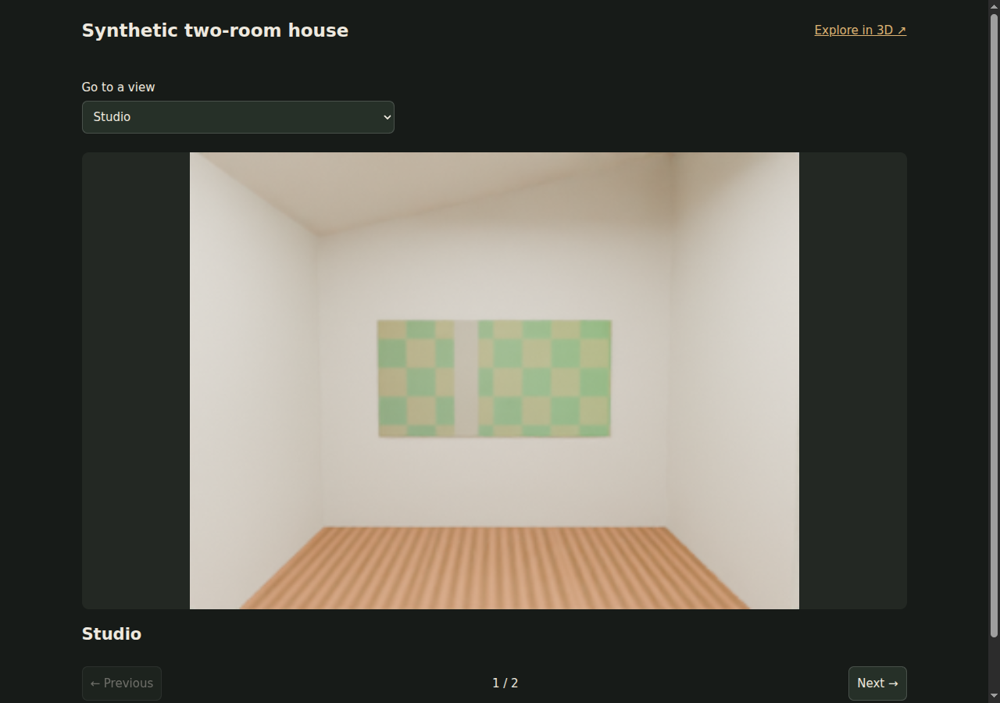

# Synthetic delivery validation

The delivery tools were exercised on 2026-09-25 using invented public geometry and generated image samples. No house project, address, photograph or accepted private measurement is included. `delivery_fixture.py` creates two rooms, 17 declared objects, a sloped ceiling, a doorway, a masked photographic checker panel, repeated grain, a mirror and clear screen. It also declares one unused source to test source selection.

## Reproduce

Install the plugin's Python requirements, Node.js/npm and Chrome/Chromium. Set an explicit Blender executable with the requested Cycles and denoising capabilities. From the repository root:

```sh
python3 -B -m unittest discover -s plugins/scan-to-model/tests -p 'test_*.py'
node --test plugins/scan-to-model/tests/viewer.test.mjs
SCAN_TO_MODEL_DELIVERY_BLENDER=/path/to/blender \
  python3 -B -m unittest discover -s plugins/scan-to-model/tests \
  -p 'test_delivery_integration.py' -v
```

Set `SCAN_TO_MODEL_DELIVERY_TEST_OUTPUT` to a fresh absolute directory to retain the integration fixture, renders, native readbacks, damaged exports and browser screenshots. Otherwise they are temporary. The integration test runs actual isolated Blender workers, npm builds and Chromium; it does not mock those tools. Its generated review notes explicitly authorize synthetic fixture assertions only. Production reviews must inspect source comparisons and rendered images.

## Contracts exercised

| Check | Observed result |
| --- | --- |
| Complete delivery | Packed native, complete GLB, two Cycles stills, used sources, still tour and offline viewer produced. |
| Native portability | Copied native reopened while every original input PNG was unavailable. Packed bytes, geometry and original source properties matched. |
| Readback must not repair | An unpacked image was rejected and remained unpacked; a disconnected shader was rejected. |
| Units and visibility | Nonmetre scene scale and a hidden parent collection were rejected. |
| Export fidelity | All 17 object identities, world vertices, oriented triangles and original source properties matched. Every photo surface retained its embedded atlas binding. |
| Damaged exports | Missing object, missing face, wrong photographic material and changed source property each failed independent GLB readback. |
| Image integrity | The used checker/grain sources were included; the declared unused source was omitted. Projection masks left explicit inferred fallback. |
| Sloped-ceiling lighting | Studio fill was placed at 2.65 m, below the actual local ceiling. |
| Overlapping trim | A 1.2 m² coplanar overlap stopped preparation before texture baking. |
| Closed doorway | All 76,800 pixels belonged to the door; zero required floor pixels prevented delivery despite supplied pass text. |
| Native-only scope | No renderer probe, preview/final render, GLB, npm build or browser check was introduced. |
| Reuse and tampering | Repackaging preserved native/build receipt timestamps; unchanged verification reused its result. Modified delivered GLB bytes were rejected. |
| Offline browser | A copied directory opened through `file://` with networking disabled, no browser errors and no external requests. All views, keyboard/touch movement, floors, roof, amber/reset and two tour slides worked. Mobile layouts had no horizontal overflow. |

The host suite passed 145 runnable tests before the final additional integration scenario, with its environment-dependent tests skipped. All four delivery integration scenarios and four JavaScript behavior tests passed separately. Six preexisting optional Blender tests were not run in that host suite. The 21 new host tests exercise appearance sampling, atlas capacity, mesh diagnostics, explicit scope, immutable sources and real raster/review contracts. Skill and plugin validators also passed; those validate packaging, not agent judgment.

The tested producer was Blender 4.0.2 build `9be62e85b727`, with a real Cycles/OpenImageDenoise probe, and Google Chrome 153.0.8010.36 in headless software-rendering mode. Browser file-origin restrictions remained enabled. The fixture's final stills used 320×240 pixels and 12 samples; previews used four samples. Exact content hashes and retained screenshot identities are in [fixtures/delivery/checks.json](fixtures/delivery/checks.json).

## Retained visual evidence

The final native stills and browser captures were also visually inspected. The checker panel contains the intentional masked stripe; the repeated grain is confined to its assigned floor. The washroom view shows the mirror and doorway, although its clear screen is low contrast. Desktop and mobile captures show usable room selection and navigation controls. These are pipeline examples, not a benchmark of architectural realism.

| Desktop room | Mobile room | Rendered still tour |
| --- | --- | --- |
| [](fixtures/delivery/room.png) | [](fixtures/delivery/mobile-room.png) | [](fixtures/delivery/tour.png) |

This synthetic fixture does not establish whole-house reconstruction quality. The producer operates on an authored candidate and an explicit project configuration. Project-specific geometry, source registration, material samples and camera choices still require work. Photo baking is planar; browser lighting is approximate, free flight has no collisions, and metric acceptance remains separate from visual completion. Workflow scenarios E–H are recorded in [workflow_scenarios.md](workflow_scenarios.md). Source/render judgment and native modeling evaluations are recorded separately in [rendered-reconstruction-scenarios.md](rendered-reconstruction-scenarios.md).
